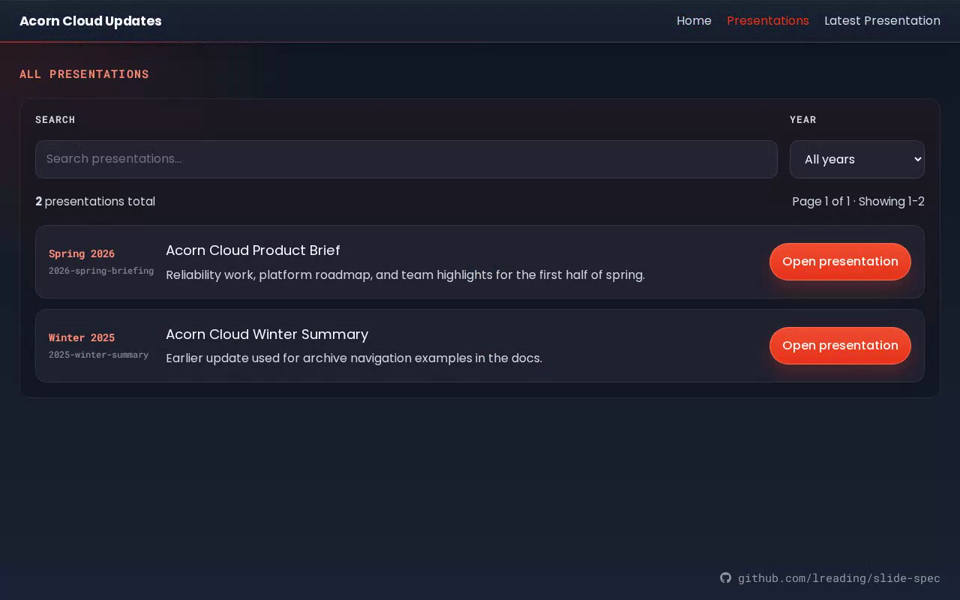
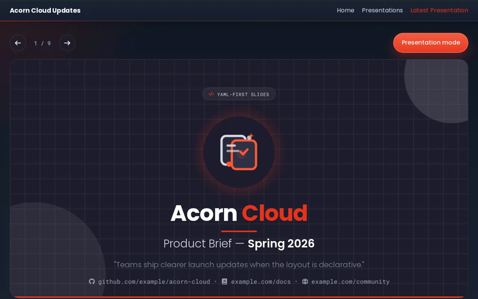
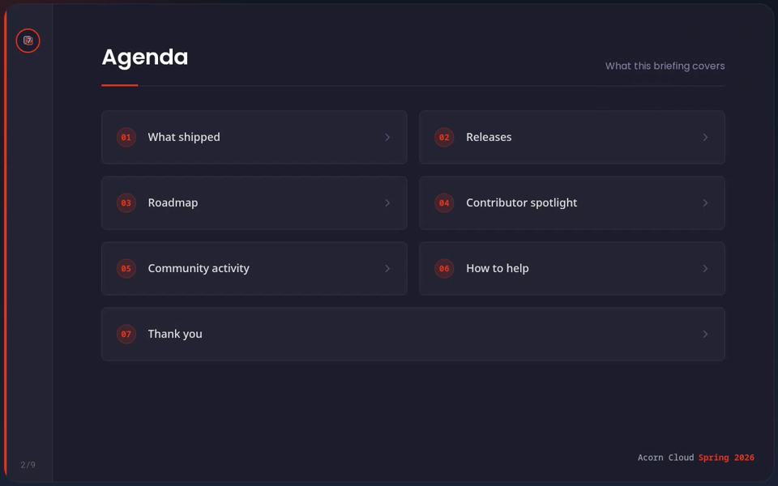
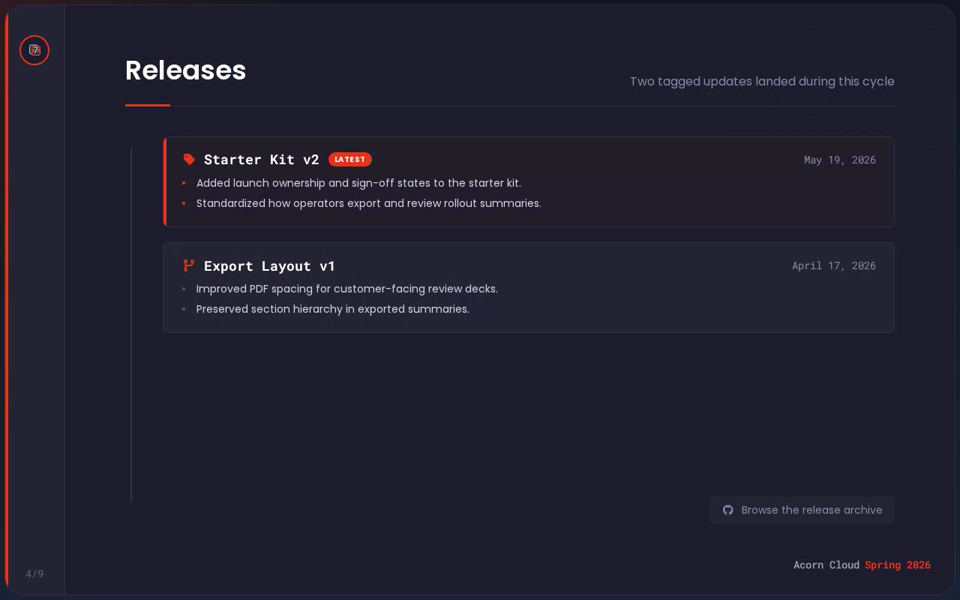
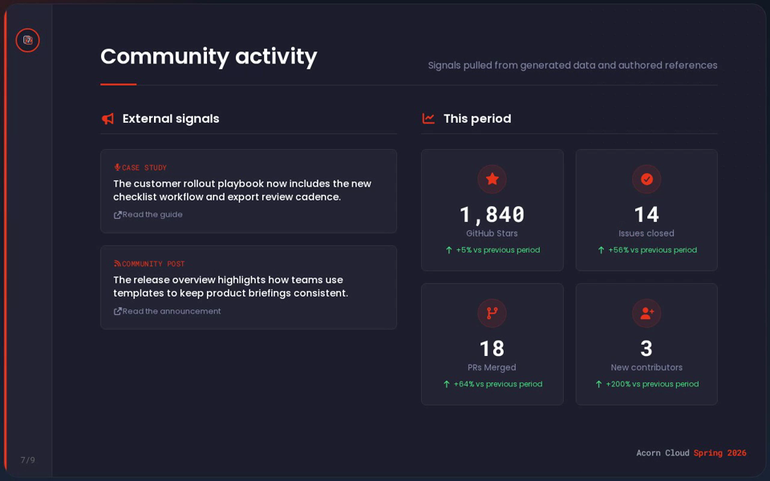
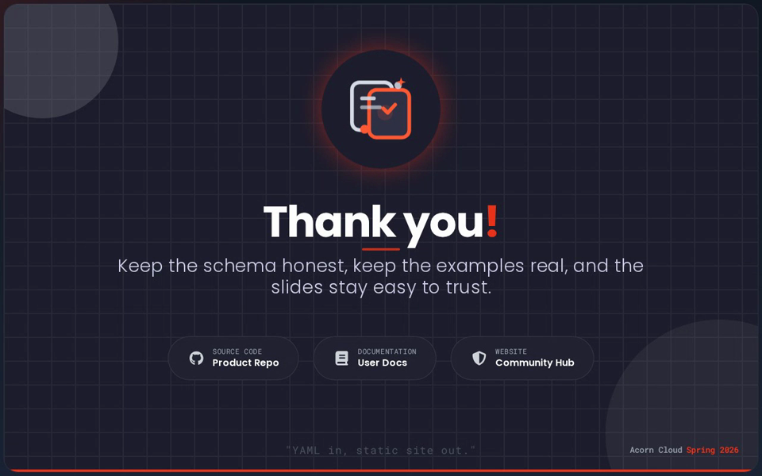

# Slide Spec

### Create beautiful slides using data, not powerpoint

  
  
  

  
  
  

<h6 align="center">
  <a href="assets/readme-demo.webm">Watch full walkthrough (WebM)</a>
</h6>

## Overview

Slide Spec grew out of open source community updates: keep release notes and roadmaps as structured data in the same repo as the code, not in a separate slide deck nobody can review in a PR.

- **Author in structured YAML** - slides and copy are data you can diff, lint, and feed from scripts or CI.
- **Static site output** - Slide Spec generates a static site you can host anywhere: CDN, S3, GitHub Pages, and similar hosts.
- **OSS first** - built for open source first, without proprietary file types or proprietary authoring software.
- **GitOps presentations** - move decks into a GitOps-style workflow with validation baked in.

## Quickstart

Use the Slide Spec CLI to get started.

Requirements: Node.js 22+ and npm.

1. **Scaffold:** `npx @slide-spec/cli init ./my-deck`
2. **Edit YAML** under `my-deck/content/` (`site.yaml`, `presentations/index.yaml`, and each deck's `presentation.yaml` / `generated.yaml`).
3. **Validate YAML:** `npx @slide-spec/cli validate ./my-deck`
4. **Preview locally:** `npx @slide-spec/cli serve ./my-deck`
5. **Build:** `npx @slide-spec/cli build ./my-deck` (produces the static site for deployment)

Optional: set a public deployment URL in `site.yaml` or pass `--deployment-url` to the `build` command if you want `sitemap.xml` generated with the correct base URL.

## Local development

### Requirements

- Node.js 24
- npm
- Git
- Playwright for app browser tests: `cd app && npx playwright install chromium`
- Docker: required for Semgrep and other tooling aligned with CI

### Repository layout

| Directory | Purpose |
| --- | --- |
| `app/` | Presentation layer |
| `cli/` | CLI used to scaffold, validate, build, and serve the site |
| `docs/` | Documentation |
| `shared/` | Shared types and YAML validation used by the app and CLI |
| `content/` | YAML for this repo's own presentations |
| `scripts/` | Maintainer scripts |

Each package directory has its own README with details for local development. Please follow [CONTRIBUTING.md](./CONTRIBUTING.md) when opening a pull request.

## Quality gates

There are several layers of quality gates to guard against regressions and breaking changes. **These gates are required to pass before code is merged.**

For local work, use `npm run verify` in each package you touch. GitHub Actions runs the same ideas automatically so the `main` branch stays stable and ready to release.
